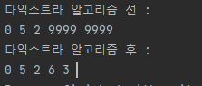

# 다익스트라알고리즘

Date: October 28, 2021

# 다익스트라(Dijkstra) 알고리즘

- 다이나믹 프로그래밍을 이용한 최단경로 탐색 알고리즘.
    - 최단거리는 여러 개의 최단 거리로 이루어져있기 때문에 DP이다.
- 특정한 하나의 정점에서 다른 모든 정점으로 가는 최단 경로를 알려준다.
- 음의 간선이 포함되지 않으면 가능하다.
- 연결되지 않은 노드에 대해서는 무한 값을 넣는다.

## 다익스트라 알고리즘의 과정

1. 출발 노드를 설정한다.
2. 출발 노드를 기준으로 각 노드의 최소 비용을 저장한다.
3. 방문하지 않은 노드 중 가장 비용이 적은 노드를 선택한다.
    1. 이때 노드들을 돌면서 찾아도 되지만 Heap을 사용하면 더 빠르게 할 수 있다.
4. 해당 노드를 거쳐 다른 노드로 가는 경우를 고려하여 최소 비용을 갱신한다.
5. 3 ~ 4번 과정을 반복한다.


출처 [https://keykat7.blogspot.com/2019/07/algorithm-dijkstra-algorithm.html](https://keykat7.blogspot.com/2019/07/algorithm-dijkstra-algorithm.html)

```java
//편의상 노드의 번호를 -1 해주었다.
//그래프를 선언해준다. 연결되지 않은 노드는 INF로 해준다. 자기 자신은 0으로 할당해준다.
//INF는 큰 값으로 선언해준다.
int INF = 9999;
int[][] graph = {
            {0, 5, 2, INF, INF},
            {5, 0, INF, 6, 3},
            {2, INF, 0, 4, 1},
            {INF, 6, 4, 0, 7},
            {INF, 3, 1, 7, 0}
};
//방문한 노드를 체크해준다.
boolean[] visited = new boolean[5];
//노드들의 거리를 기록해준다.
int[] distance = new int[5];

void dijkstra(int n){
        //시작 노드로부터 가중치가 낮은 것부터 돌기 위해 우선순위 큐를 선언해준다.
        //int[]{노드 번호, 가중치} 순으로 queue에 집어넣을 것이기 때문에 comparator을 통해 우선순위를 조정해주었다.
        PriorityQueue<int[]> queue = new PriorityQueue<>(Comparator.comparingInt(o -> o[1]));
        //그래프를 참고하여 시작 노드부터의 각 노드들의 거리를 할당해준다.
        for(int i=0; i < 5; i++){
            distance[i] = graph[n][i];
            queue.add(new int[]{i, distance[i]});
        }

        //시작 노드를 방문처리한다.
        visited[n] = true;

        while(!queue.isEmpty()){
            //가장 가중치가 낮은 것을 뽑아온다.
            int[] target = queue.poll();
            visited[target[0]] = true;
            //최단 거리가 아니면 continue;
            if(distance[target[0]] < target[1]) continue;
            for(int i=0; i < graph[target[0]].length; i++){
                if(!visited[i]){
                    //인접 노드를 찾는다.
                    int next = i;
                    //선택 노드를 인접 노드를 거쳐 가는 비용을 체크한다.
                    int nextDistance = distance[target[0]] + graph[target[0]][i];
                    //기존 최소비용보다 저렴하다면 교체한다.
                    if(nextDistance < distance[next]){
                        distance[next] = nextDistance;
                        queue.add(new int[]{next, nextDistance});
                    }
                }
            }
        }

    }
```

다익스트라 실행 시 0번 노드로부터의 최단거리 갱신 :



참고 사이트 :

[https://m.blog.naver.com/ndb796/221234424646](https://m.blog.naver.com/ndb796/221234424646)

[https://keykat7.blogspot.com/2019/07/algorithm-dijkstra-algorithm.html](https://keykat7.blogspot.com/2019/07/algorithm-dijkstra-algorithm.html)